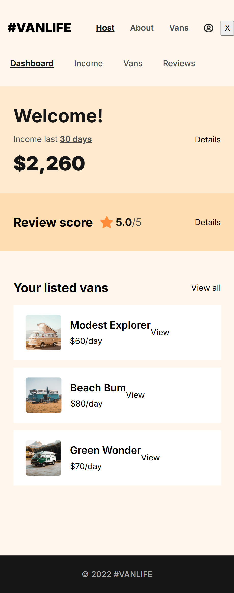
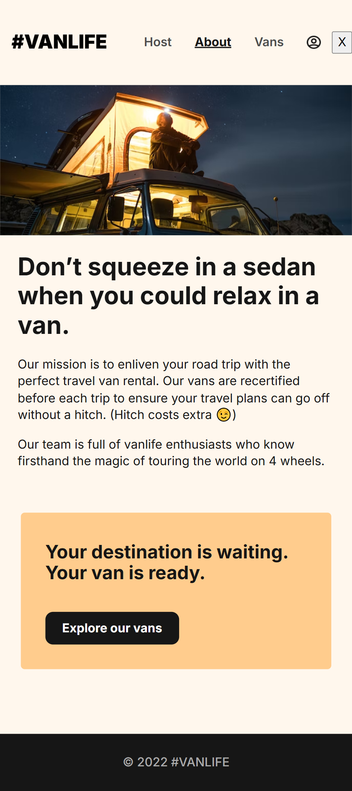

# VansLife - Van Rental Application
## REACT ROUTER V6 + FIREBSE FIRESTORE

## Project Overview
VansLife is a React-based web application for a fictional van rental service. The application allows users to browse available vans, view detailed information about each van, and hosts to manage their listed vans.

## Website Templates

<div style='display:flex; align-items: flex-start;width:100vw; gap:3%; border:2px solid red; padding:20px 10p; align-items:start;'>
      
      
      
</div>

## Mobile Templates

<div style='display:flex; align-items: flex-start; flex-wrap:wrap; width:100vw; gap:8%;border:2px solid red; padding:20px 10px;'>
      
      
      
      
      
      
</div>


## Features
- **Browse Vans**: Users can view all available vans with filtering options
- **Van Details**: Detailed information about each van including price, type, and description
- **Host Dashboard**: Hosts can view their listed vans, income, and reviews
- **Authentication**: User login functionality with protected routes
- **Responsive Design**: Mobile-friendly interface

## Technology Stack
- React
- React Router v6
- Firebase (Firestore)
- CSS

## React Router Implementation
This project showcases advanced React Router v6 features:

### Routing Structure
- **Nested Routes**: Implemented using the `<Outlet>` component for shared layouts
- **Protected Routes**: Authentication-required routes using `requireAuth` utility
- **Dynamic Routes**: Van details pages using URL parameters
- **Error Handling**: Custom error elements for failed data loading

### Key Router Features Used
- **Data Loading**: Using loaders to fetch data before rendering components
- **Form Actions**: Handling form submissions with action functions
- **Error Elements**: Graceful error handling with dedicated error components
- **Route Parameters**: Dynamic routing with URL parameters

## Project Structure
```
├── components/       # Reusable UI components
├── pages/            # Page components
│   ├── Host/         # Host dashboard pages
│   ├── Vans/         # Van listing and detail pages
├── assets/           # Static assets
├── api.js            # Firebase API integration
├── utils.js          # Utility functions
├── index.jsx         # Main entry point with router configuration
└── server.js         # Mock server for development
```

## Getting Started

```
# Install dependencies
npm install

# Start development server
npm start
```

## Authentication
- Use the following credentials for testing:
  - Email: saleh@example.com
  - Password: 123456

## Data Structure
The application uses Firebase Firestore to store van data with the following structure:
- id: Unique identifier
- name: Van name
- price: Daily rental price
- description: Van description
- imageUrl: Image URL
- type: Van type (simple, luxury, rugged)
- hostId: ID of the host who owns the van


